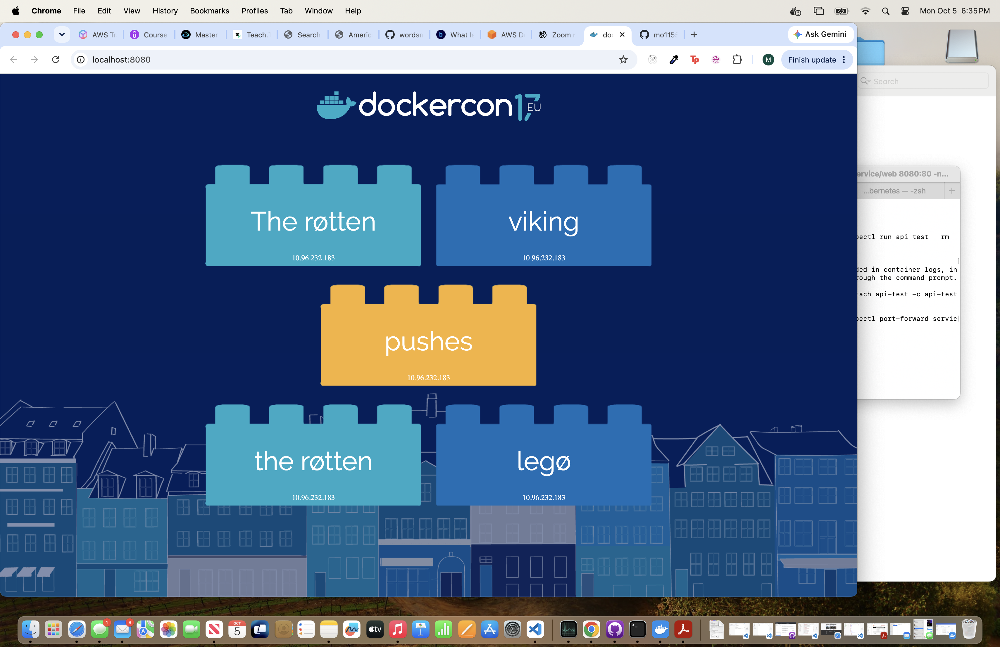

# Wordsmith Kubernetes Deployment

A three-tier Wordsmith application deployed on Kubernetes using Kind.

The application generates random word combinations through three connected components:

- **Web** — Frontend interface
- **API** — Application backend
- **Database** — PostgreSQL database

## Architecture

```text
Browser → Web Service → Web Pods → API Service → API Pods → DB Service → PostgreSQL
```

## Kubernetes Resources

| Component | Workload | Service |
|---|---|---|
| Web | Deployment | ClusterIP |
| API | Deployment | ClusterIP |
| Database | StatefulSet | Headless Service |

## Project Structure

```text
.
├── docs/
│   └── images/
│       └── wordsmith-running.png
└── kubernetes/
    ├── namespace/
    │   └── namespace.yaml
    ├── db/
    │   └── database.yaml
    ├── api/
    │   └── api.yaml
    └── web/
        └── web.yaml
```

## Prerequisites

- Docker Desktop
- kubectl
- Kind

## Deploy the Application

Create a local cluster:

```bash
kind create cluster --name wordsmith-dev
```

Apply the manifests in order:

```bash
kubectl apply -f kubernetes/namespace/namespace.yaml
kubectl apply -f kubernetes/db/database.yaml
kubectl apply -f kubernetes/api/api.yaml
kubectl apply -f kubernetes/web/web.yaml
```

Check the resources:

```bash
kubectl get all -n wordsmith
```

Access the application:

```bash
kubectl port-forward service/web 8080:80 -n wordsmith
```

Open:

```text
http://localhost:8080
```

## Application Screenshot



## Troubleshooting Performed

During deployment, the frontend loaded but did not display words. Troubleshooting included:

- Inspecting Pod status and logs
- Testing Kubernetes Services from temporary Pods
- Verifying DNS and network connectivity
- Identifying PostgreSQL authentication failures
- Confirming successful communication between the API and database
- Retesting the API endpoint before accessing the frontend

## Skills Demonstrated

- Kubernetes Deployments and StatefulSets
- Kubernetes Services and internal DNS
- Namespace organization
- Container troubleshooting
- Pod logs and service testing
- Port forwarding
- PostgreSQL connectivity
- Multi-tier application deployment

## Cleanup

```bash
kind delete cluster --name wordsmith-dev
```